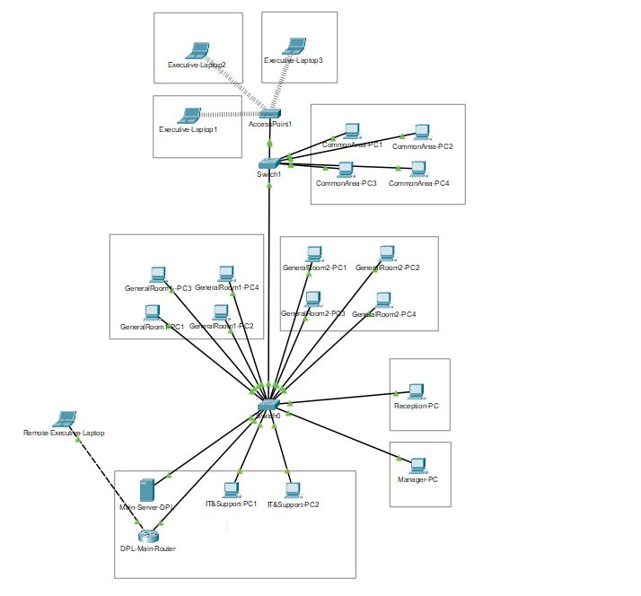

# Two Floor Network Design – Cisco Packet Tracer

## Overview
Designed a structured two-floor network using Cisco Packet Tracer to simulate a small office environment.
## Network Topology

## Network Design
- Separate VLANs for each floor
- Router configuration
- Switch configuration
- Static IP addressing
- Inter-floor communication

## Technologies Used
- Cisco Packet Tracer
- VLAN configuration
- Routing
- Subnetting
- Network topology design

## Learning Outcome
- Improved understanding of LAN design
- Practiced IP addressing & subnetting
- Implemented structured network segmentation
